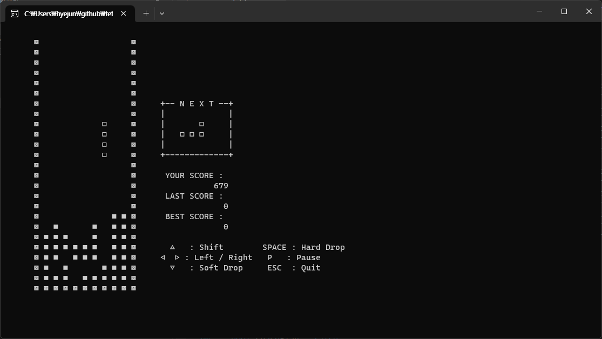
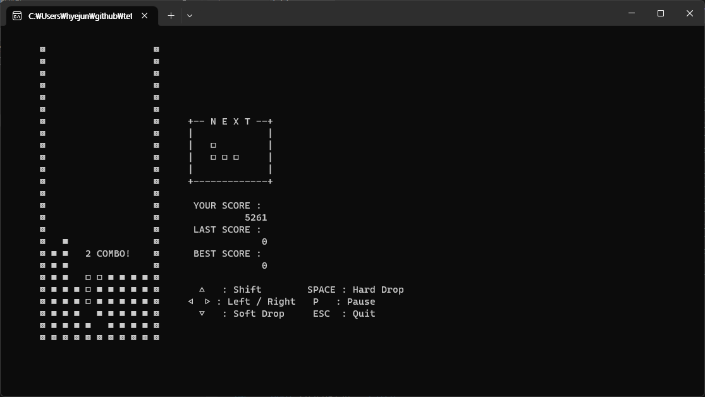
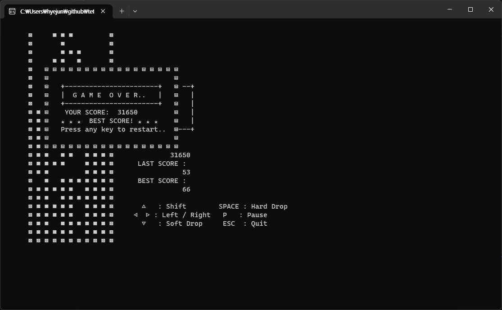

# CLI Tetris

CLI(Command Line Interface)로 플레이하는 콘솔 테트리스입니다.

## Demo

    
    

    

## 조작키

* 방향키 &nbsp;&nbsp; &nbsp;↑ &nbsp;&nbsp; : 회전
* 방향키 ← &nbsp; → : 좌우 이동

 

* SPACE : Hard drop
* P &nbsp; &nbsp; &nbsp; &nbsp; : 일시 정지
* ESC &nbsp;&nbsp;&nbsp; : 종료

## Environment
* Windows 11
* Visual Studio 2022
